# TC 微服务认证链路流程图

## 🔄 用户登录认证完整流程

```mermaid
sequenceDiagram
    participant C as 客户端
    participant G as 网关(tc-gateway)
    participant U as 用户服务(tc-user-service)
    participant R as Redis缓存
    participant D as MySQL数据库

    Note over C,D: 阶段1: 用户登录流程

    C->>G: 1. POST /api/auth/login<br/>{username, password}
    Note over G: 检查公开路径白名单
    
    G->>U: 2. 转发登录请求
    Note over U: 验证用户名密码
    
    U->>R: 3. 检查登录失败次数
    R-->>U: 返回失败次数
    
    U->>D: 4. 查询用户信息
    D-->>U: 返回用户数据
    
    Note over U: 验证密码哈希
    
    U->>U: 5. 生成JWT Token
    Note over U: 包含userId, username
    
    U->>R: 6. 缓存用户信息
    U->>D: 7. 记录登录日志
    
    U->>G: 8. 返回登录响应<br/>{accessToken, refreshToken, userInfo}
    G->>C: 9. 返回最终响应

    Note over C,D: 阶段2: 访问受保护资源流程

    C->>G: 10. GET /api/user/profile<br/>Authorization: Bearer token
    Note over G: 提取Bearer Token
    
    G->>R: 11. 检查Token黑名单
    R-->>G: 返回黑名单状态
    
    Note over G: 验证JWT Token<br/>解析用户信息
    
    G->>G: 12. 添加用户信息到请求头<br/>X-User-Id, X-Username
    
    G->>U: 13. 转发请求到用户服务
    Note over U: 从请求头获取用户信息
    
    U->>U: 14. 执行业务逻辑
    U->>G: 15. 返回业务数据
    G->>C: 16. 返回最终响应

    Note over C,D: 阶段3: 用户登出流程

    C->>G: 17. POST /api/auth/logout<br/>Authorization: Bearer token
    Note over G: 提取Token
    
    G->>R: 18. 将Token加入黑名单
    Note over R: 设置TTL: 24小时
    
    G->>U: 19. 转发登出请求
    U->>D: 20. 记录登出日志
    
    U->>G: 21. 返回登出成功
    G->>C: 22. 返回登出响应
```

## 🏗️ 系统架构图

```mermaid
graph TB
    subgraph "客户端层"
        C1[Web前端]
        C2[移动端]
        C3[第三方应用]
    end
    
    subgraph "网关层"
        G1[TC Gateway<br/>统一认证入口]
        G2[JWT认证过滤器]
        G3[路由转发]
        G4[异常处理]
    end
    
    subgraph "服务层"
        S1[TC User Service<br/>用户服务]
        S2[TC Auth Service<br/>认证服务]
        S3[TC Core Service<br/>核心服务]
    end
    
    subgraph "数据层"
        R1[Redis<br/>缓存/会话]
        D1[MySQL<br/>用户数据]
        D2[MySQL<br/>业务数据]
    end
    
    subgraph "安全层"
        SEC1[JWT Token]
        SEC2[黑名单机制]
        SEC3[密码加密]
        SEC4[登录保护]
    end
    
    C1 --> G1
    C2 --> G1
    C3 --> G1
    
    G1 --> G2
    G2 --> G3
    G3 --> G4
    
    G3 --> S1
    G3 --> S2
    G3 --> S3
    
    S1 --> R1
    S1 --> D1
    S2 --> R1
    S2 --> D1
    S3 --> D2
    
    G2 --> SEC1
    G2 --> SEC2
    S1 --> SEC3
    S1 --> SEC4
    
    style G1 fill:#e1f5fe
    style S1 fill:#f3e5f5
    style R1 fill:#fff3e0
    style D1 fill:#e8f5e8
```

## 🔐 认证状态流转图

```mermaid
stateDiagram-v2
    [*] --> 未认证: 用户访问
    
    未认证 --> 登录中: 提交登录信息
    登录中 --> 认证成功: 用户名密码正确
    登录中 --> 认证失败: 用户名密码错误
    认证失败 --> 登录中: 重新登录
    认证失败 --> 账户锁定: 失败次数超限
    
    认证成功 --> 已认证: 生成JWT Token
    已认证 --> 访问资源: 携带Token请求
    访问资源 --> 已认证: Token验证通过
    访问资源 --> Token失效: Token过期/无效
    
    Token失效 --> 未认证: 重新登录
    已认证 --> 登出: 用户主动登出
    登出 --> 未认证: Token加入黑名单
    
    账户锁定 --> 未认证: 锁定时间到期
```

## 📊 数据流向图

```mermaid
flowchart LR
    subgraph "请求数据流"
        A[客户端请求] --> B[网关接收]
        B --> C[JWT验证]
        C --> D[路由转发]
        D --> E[服务处理]
        E --> F[数据查询]
        F --> G[响应返回]
    end
    
    subgraph "缓存数据流"
        H[用户信息] --> I[Redis缓存]
        I --> J[Token黑名单]
        J --> K[登录计数]
    end
    
    subgraph "持久化数据流"
        L[用户数据] --> M[MySQL存储]
        M --> N[登录日志]
        N --> O[业务数据]
    end
    
    C --> I
    E --> M
    F --> H
```

## 🛡️ 安全防护流程图

```mermaid
flowchart TD
    A[请求到达网关] --> B{检查公开路径}
    B -->|是| C[直接转发]
    B -->|否| D[提取JWT Token]
    
    D --> E{Token格式正确?}
    E -->|否| F[返回401未授权]
    E -->|是| G[检查黑名单]
    
    G --> H{Token在黑名单?}
    H -->|是| F
    H -->|否| I[验证Token签名]
    
    I --> J{签名验证通过?}
    J -->|否| F
    J -->|是| K[检查Token过期]
    
    K --> L{Token未过期?}
    L -->|否| F
    L -->|是| M[解析用户信息]
    
    M --> N[添加用户信息到请求头]
    N --> O[转发到下游服务]
    
    style F fill:#ffebee
    style O fill:#e8f5e8
```

## 🔄 错误处理流程图

```mermaid
flowchart TD
    A[异常发生] --> B{异常类型}
    
    B -->|NotFoundException| C[服务不可用<br/>返回404]
    B -->|ResponseStatusException| D[响应状态异常<br/>返回对应状态码]
    B -->|JWT异常| E[Token无效<br/>返回401]
    B -->|其他异常| F[系统内部错误<br/>返回500]
    
    C --> G[统一错误响应格式]
    D --> G
    E --> G
    F --> G
    
    G --> H[记录错误日志]
    H --> I[返回错误响应]
    
    style C fill:#fff3e0
    style D fill:#fff3e0
    style E fill:#ffebee
    style F fill:#ffebee
    style G fill:#e8f5e8
```

## 📈 性能监控流程图

```mermaid
flowchart LR
    A[请求开始] --> B[记录开始时间]
    B --> C[处理请求]
    C --> D[记录结束时间]
    D --> E[计算响应时间]
    E --> F[更新性能指标]
    F --> G[检查告警阈值]
    G --> H{超过阈值?}
    H -->|是| I[发送告警]
    H -->|否| J[记录指标]
    I --> J
    J --> K[存储监控数据]
    
    style I fill:#ffebee
    style J fill:#e8f5e8
```

