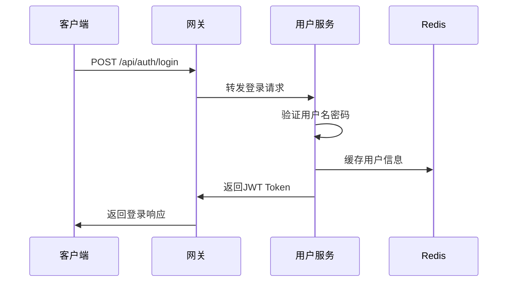
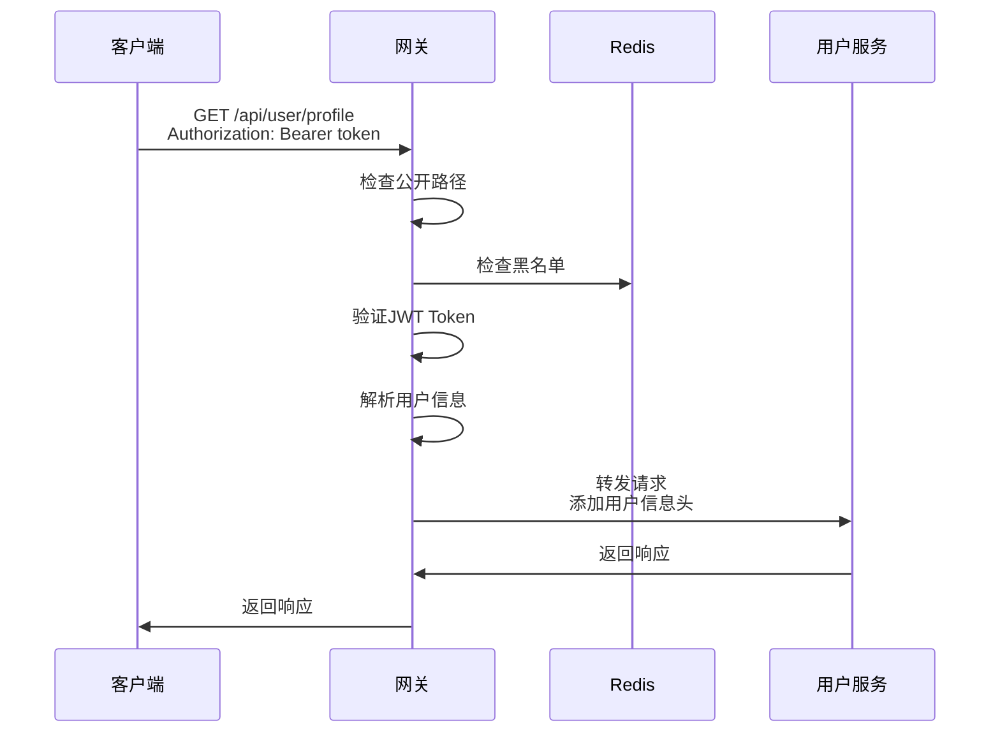

# TC Gateway 网关模块实现总结

## 🎯 项目概述

已成功创建了 `tc-gateway` 网关模块，按照现有项目风格实现了统一的认证验证功能。网关作为微服务架构的入口，负责处理所有外部请求的认证、路由转发和负载均衡。

## 📁 项目结构

```
tc-gateway/
├── pom.xml                                    # Maven配置
├── Dockerfile                                 # Docker镜像构建
├── docker-compose.yml                         # Docker编排
├── start.bat / start.sh                       # 启动脚本
├── README.md                                  # 项目文档
└── src/main/
    ├── java/com/tcyh/gateway/
    │   ├── TcGatewayApplication.java          # 启动类
    │   ├── config/                           # 配置类
    │   │   ├── CorsConfig.java              # CORS跨域配置
    │   │   ├── GatewayConfig.java           # 网关路由配置
    │   │   └── RedisConfig.java             # Redis配置
    │   ├── filter/                          # 过滤器
    │   │   └── JwtAuthenticationFilter.java # JWT认证过滤器
    │   ├── handler/                         # 处理器
    │   │   └── GlobalExceptionHandler.java  # 全局异常处理
    │   └── util/                           # 工具类
    │       └── JwtUtil.java                 # JWT工具类
    └── resources/
        ├── application.yml                   # 应用配置
        └── application-docker.yml           # Docker环境配置
```

## 🔧 核心功能实现

### 1. JWT认证过滤器 (`JwtAuthenticationFilter`)

**功能特点：**
- ✅ 全局过滤器，优先级最高 (`Order = -100`)
- ✅ 支持公开路径白名单
- ✅ JWT Token验证和解析
- ✅ Redis黑名单检查
- ✅ 用户信息传递到下游服务

**认证流程：**
1. 检查请求路径是否为公开路径
2. 提取Authorization头中的Bearer Token
3. 检查Token是否在黑名单中
4. 验证Token有效性和过期时间
5. 解析用户信息并添加到请求头
6. 转发请求到下游服务

### 2. 路由配置 (`GatewayConfig`)

**支持的路由：**
- `/api/auth/**` → 认证服务
- `/api/user/**` → 用户服务  
- `/api/public/**` → 公开接口
- `/api/test/**` → 测试接口
- `/swagger-ui/**` → API文档
- `/actuator/**` → 健康检查

**路由特性：**
- ✅ 路径重写 (`StripPrefix=1`)
- ✅ 请求头添加 (`X-Gateway`, `X-User-Id`, `X-Username`)
- ✅ 负载均衡支持

### 3. 全局异常处理 (`GlobalExceptionHandler`)

**处理异常类型：**
- ✅ `NotFoundException` - 服务不可用 (404)
- ✅ `ResponseStatusException` - 响应状态异常
- ✅ 其他异常 - 系统内部错误 (500)

**响应格式：**
```json
{
  "code": 401,
  "message": "Token无效或已过期",
  "timestamp": 1697123456789,
  "path": "/api/user/profile"
}
```

### 4. CORS跨域配置 (`CorsConfig`)

**配置特点：**
- ✅ 支持所有来源 (`*`)
- ✅ 支持所有HTTP方法
- ✅ 支持所有请求头
- ✅ 允许携带凭证

## 🚀 技术栈

| 技术 | 版本 | 用途 |
|------|------|------|
| Spring Cloud Gateway | 2022.0.1 | 微服务网关 |
| Spring Boot | 3.0.5 | 应用框架 |
| Spring Security | 6.x | 安全框架 |
| Redis | 7.0 | 缓存和会话 |
| JWT | 0.11.5 | 无状态认证 |
| Redisson | 3.19.1 | 分布式锁 |
| Lombok | - | 代码简化 |

## 📋 配置说明

### 应用配置 (`application.yml`)

```yaml
server:
  port: 8080

spring:
  application:
    name: tc-gateway
  redis:
    host: localhost
    port: 6379
    database: 0
  cloud:
    gateway:
      discovery:
        locator:
          enabled: true
          lower-case-service-id: true

jwt:
  secret: tc-gateway-jwt-secret-key-for-distributed-system
  expiration: 86400
```

### Docker配置

**Dockerfile:**
- 基于 OpenJDK 17
- 暴露端口 8080
- 支持Docker环境配置

**docker-compose.yml:**
- 集成MySQL、Redis、用户服务
- 服务依赖和健康检查
- 数据卷持久化

## 🔄 认证流程

### 1. 用户登录流程



### 2. 请求认证流程



## 🛠️ 部署方式

### 1. 本地开发

```bash
# 启动Redis
redis-server

# 启动MySQL
# 创建数据库 tc_user

# 编译运行
mvn clean package -DskipTests
java -jar target/tc-gateway.jar
```

### 2. Docker部署

```bash
# 构建镜像
docker build -t tc-gateway .

# 运行容器
docker run -d -p 8080:8080 --name tc-gateway tc-gateway
```

### 3. Docker Compose部署

```bash
# 启动所有服务
docker-compose up -d

# 查看日志
docker-compose logs -f tc-gateway
```

## 🔍 监控和管理

### 健康检查

```bash
# 网关健康状态
GET /actuator/health

# 网关指标
GET /actuator/metrics

# 网关路由信息
GET /actuator/gateway/routes
```

### 日志配置

```yaml
logging:
  level:
    com.tcyh.gateway: DEBUG
    org.springframework.cloud.gateway: DEBUG
```

## 🔐 安全特性

### 1. JWT Token验证
- ✅ Token格式验证
- ✅ 签名验证
- ✅ 过期时间检查
- ✅ 用户信息提取

### 2. 黑名单机制
- ✅ Redis存储黑名单
- ✅ 登出Token失效
- ✅ 异常Token拦截

### 3. 请求头安全
- ✅ 用户信息传递
- ✅ 网关标识添加
- ✅ 敏感信息过滤

## 📈 性能优化

### 1. 缓存策略
- ✅ Redis缓存用户信息
- ✅ Token验证结果缓存
- ✅ 路由信息缓存

### 2. 连接池配置
- ✅ Redis连接池优化
- ✅ HTTP连接池配置
- ✅ 线程池调优

### 3. 异步处理
- ✅ 响应式编程模型
- ✅ 非阻塞I/O
- ✅ 背压处理

## 🚨 注意事项

### 1. 生产环境配置
- ⚠️ 修改JWT密钥为强密钥
- ⚠️ 配置Redis集群
- ⚠️ 启用HTTPS
- ⚠️ 配置日志级别

### 2. 安全建议
- ⚠️ 定期轮换JWT密钥
- ⚠️ 监控异常登录
- ⚠️ 限制请求频率
- ⚠️ 启用审计日志

### 3. 性能监控
- ⚠️ 监控响应时间
- ⚠️ 监控错误率
- ⚠️ 监控资源使用
- ⚠️ 设置告警阈值

## 🎉 总结

TC Gateway 网关模块已成功实现，具备以下特点：

1. **统一认证**: 所有微服务的认证都通过网关处理
2. **路由转发**: 支持动态路由和负载均衡
3. **安全防护**: JWT验证、黑名单机制、CORS处理
4. **异常处理**: 统一的错误响应格式
5. **监控管理**: 健康检查、指标监控
6. **容器化**: 支持Docker部署
7. **文档完善**: 详细的README和配置说明

网关模块按照现有项目风格实现，与用户服务完美集成，为微服务架构提供了统一的入口和安全保障。
